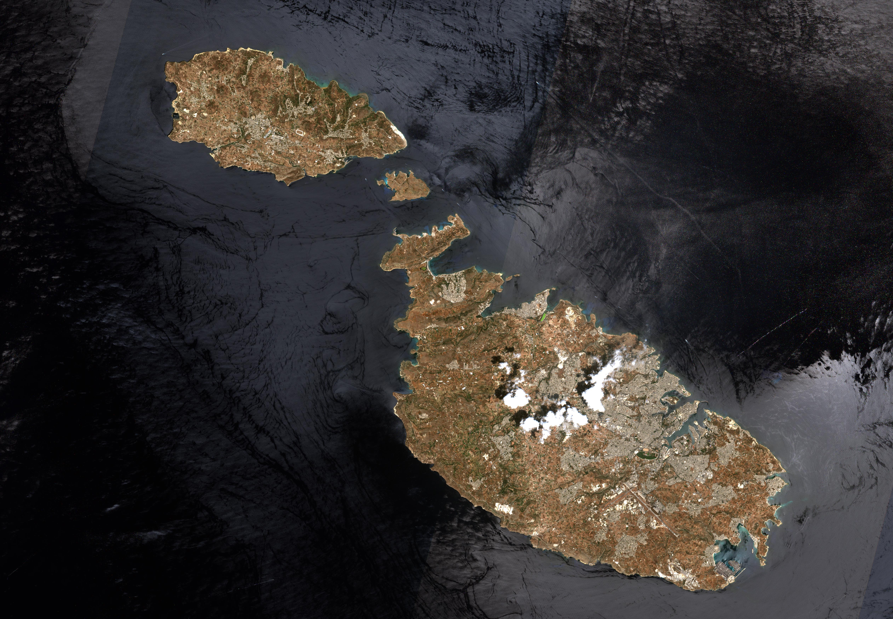
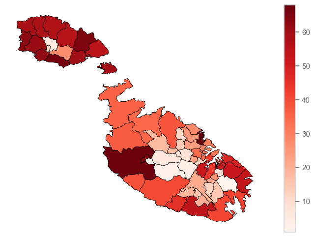
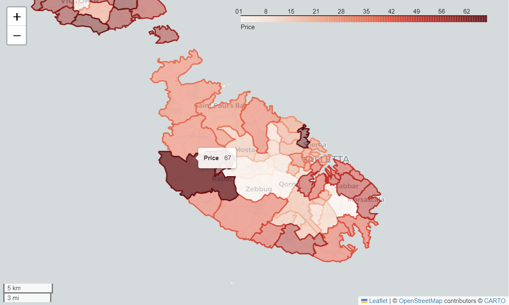

# GeoMalta, a GeoPandas toolkit for Malta.

GeoMalta is a GeoPandas toolkit designed specifically for working with geospatial data in the context of Malta. This toolkit provides a set of tools and functions to facilitate the exploration, analysis, and visualization of geospatial data related to Malta's geography.

Using shapefile provided by the The Planning Authority. 
https://msdi.data.gov.mt/geonetwork/srv/api/records/4c949ce6-70aa-4b18-b806-2e5a1a9544f9




# Usage

## Choropleth map

```python
malta.plot(column='[Your data point]', cmap='Reds', linewidth=0.5, ax=ax, edgecolor='0', legend=True)
```



## Interactive mapping

```python
malta.explore()
```


## Hexagonal binning map
Coming Soon!

## Heat map
Coming Soon!

## Cartogram map
Coming Soon!

# Contributing
GeoMalta is an open-source project, and contributions are welcome. If you encounter any issues, have suggestions, or would like to contribute new features or improvements, please visit the project's GitHub repository to create an issue or submit a pull request.


